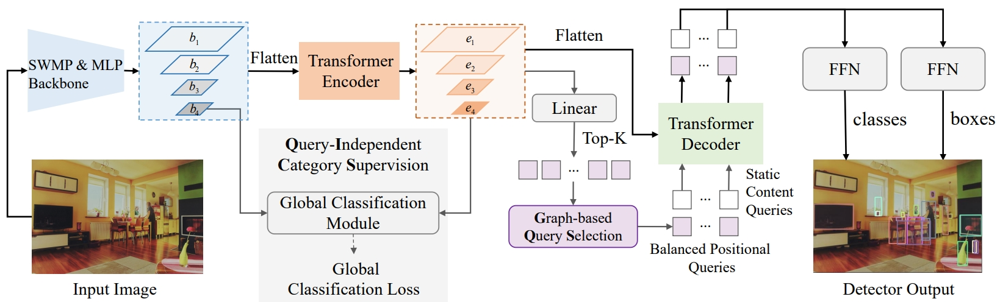

# MLP-DINO
This is the official code (based on Pytorch framework) for the paper "MLP-DINO: Category Modeling and Query Graphing with Deep MLP for Object Detection".

## Updates

***17/04/2024***

`News`: Our new work ``MLP-DINO: Category Modeling and Query Graphing with Deep MLP for Object Detection'' has been accepted to [IJCAI2024](https://ijcai24.org/). Strip-MLP is extended to be a strong backbone for downstream task of object detection. More information about Strip-MLP can be found in [Strip-MLP](https://github.com/Med-Process/Strip_MLP/tree/main).

## Framework


## Models

* Download models: [models](https://pan.baidu.com/s/13KUQLSlXMQTwLTbQqba_ZQ?pwd=1234)

## Citations


```
@inproceedings{cao2024mlp,
title={MLP-DINO: category modeling and query graphing with deep MLP for object detection},
author={Cao, Guiping and Huang, Wenjian and Lan, Xiangyuan and Zhang, Jianguo and Jiang, Dongmei and Wang, Yaowei},
booktitle={Proceedings of the Thirty-Third International Joint Conference on Artificial Intelligence (IJCAI-24), Jeju, Republic of Korea},
pages={3--9},
year={2024}
}
```


## License

[](https://opensource.org/licenses/MIT)


## Acknowledgement

Our source codes are built on top of [DINO](https://github.com/IDEA-Research/DINO), [Strip-MLP](https://github.com/Med-Process/Strip_MLP), and [Swin-Transformer](https://github.com/microsoft/Swin-Transformer).
